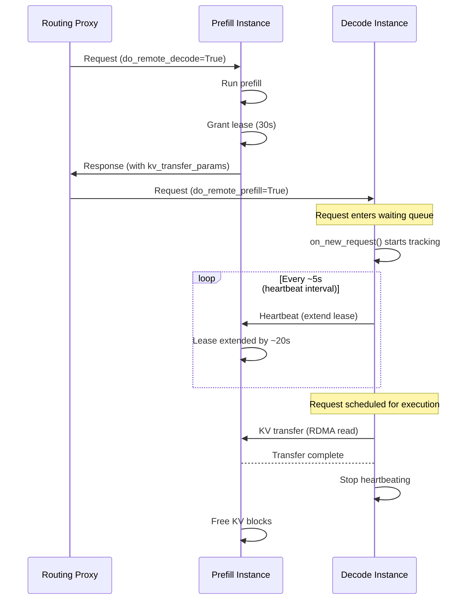
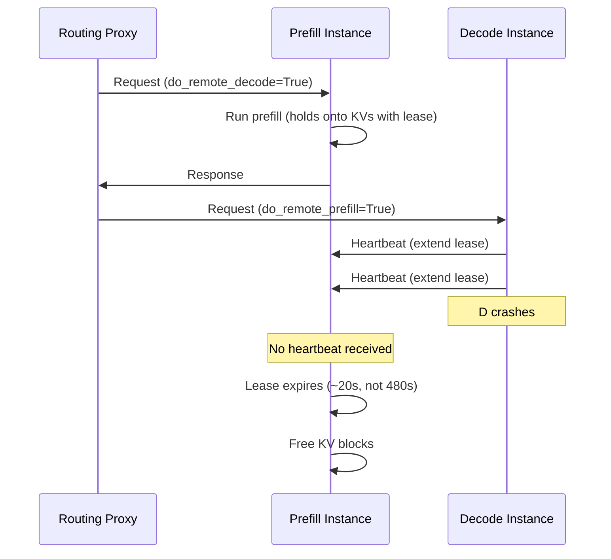

# NIXL の KV キャッシュリース更新 { #nixl-kv-cache-lease-renewal }

プレフィル / デコードを分離したデプロイでは、プレフィルインスタンス（P）はプレフィル完了後も KV キャッシュのブロックを GPU メモリ上に保持し、デコードインスタンス（D）が RDMA でそれを読み出すのを待つ必要があります。D が取得できなかった場合に、それらのブロックをいつ安全に解放できるかを判断する仕組みが必要です。この仕組みは [PR #41383](https://github.com/vllm-project/vllm/pull/41383) で導入されました。

## 動機 { #motivation }

### 単一タイムアウトの問題 { #the-single-timeout-problem }

当初の設計では、P が KV ブロックを保持する時間を単一の大きなタイムアウト（`VLLM_NIXL_ABORT_REQUEST_TIMEOUT`、既定 480 秒）で制御していました。D がクラッシュしたり切断されたりすると、P は場合によっては数 GB にもなる「死んだ」ブロックを最大 8 分間保持し続けてから回収します。この間、P に到達する後続のリクエストは利用できるキャッシュ容量が減り、性能が低下します。

### 過負荷の問題 { #the-overloading-problem }

単純にタイムアウトを短くすると、別の障害モードが生まれます。トラフィックが急増すると、リクエストがスケジュールされるまで D の待機キューに長時間留まることがあります。P 側の固定タイムアウトが短すぎると、D が読み出す機会を得る前にブロックが解放され、不要な再計算とプレフィル作業の無駄が発生します。

### 解決策: ハートビートによるリース更新 { #solution-lease-renewal-via-heartbeats }

リース更新の仕組みは、この 2 つの問題を同時に解決します。P はプレフィル完了時に**短い初期リース**（既定 30 秒）を付与します。リクエストが D 上で**キューに入っている、または処理中の**間、D は P に**定期的にハートビートを送信**してリースを延長します。D がクラッシュしてハートビートが止まれば、P は数分待つのではなく、最後のハートビートから数秒以内にブロックを回収します。D が単に過負荷なだけであれば、ハートビートによって必要な間だけブロックが保持され続けます。

## 動作の仕組み { #how-it-works }

### リースのライフサイクル { #lease-lifecycle }

P はプレフィルを終えると、初期のリース期間（`kv_lease_duration`、既定 30 秒）とともに KV ブロックをピン留めします。その時点から、次のいずれかが起きるまでブロックは保持されます。

1. **D が KV 転送を完了する** — P は読み出し完了の通知を受け取り、ただちにブロックを解放します。
2. **D がハートビートを送り続ける** — 各ハートビートがリースを `lease_duration * 2/3`（約 20 秒）延長し、D が正常な間はブロックが保持され続けます。
3. **ハートビートが届かない** — リースが期限切れになり、P がブロックを回収します。

### NIXL の通知への相乗り { #piggybacking-on-nixl-notifications }

新しい転送チャンネルを導入する代わりに、ハートビートは NIXL の既存の通知システム（`send_notif` / `get_new_notifs`）を再利用します。通知の媒体はバックエンドごとに異なり、IB/RoCE から TCP への自動フォールバックはすでに NIXL 側で処理されています。D から特定の P に送られる 1 通のハートビートメッセージは、その D のために P 上でピン留めされているすべてのリクエストを更新します。つまり、イテレーションごとに 1 通のバッチ化されたメッセージで、複数リクエストのリースが更新されます。

### スケジューラ側での追跡（D） { #scheduler-side-tracking-d }

重要な洞察は、ハートビートは実行のためにスケジュールされた時点ではなく、**リクエストが D のスケジューラに入った直後**から始めなければならない、という点です。高負荷時には、リクエストが初期リース期間よりずっと長く待機キューに留まることがあり、到着からスケジュールまでの間隔に上限はありません。

これを実現するため、D のコネクタ（`NixlConnectorScheduler`）は `on_new_request()` を通じてスケジューラにフックします。`do_remote_prefill=True` のリクエストが到着すると、コネクタはただちにハートビートのための追跡を開始します。効率的にバッチ化するため、リクエストは `remote_engine_id` ごとにグループ化されます。スケジューラの各ステップで、ハートビートのメタデータが `NixlConnectorMetadata` にまとめられてワーカーに送られ、`lease_duration // 6`（約 5 秒）のハートビート間隔で送信頻度が抑えられます。

追跡は、KV 転送が完了したとき（`update_connector_output` 経由）、またはリクエストが完了・中断したとき（`request_finished` 経由）に停止します。

### タイミングと単純さ { #timing-and-simplicity }

ハートビートの送信と処理は、バックグラウンドスレッドではなく **forward ループの中**で行われます。つまりタイミングはミリ秒単位の精度ではなく、モデルの forward パスが長ければハートビートは遅れます。しかしリース期間には十分な余裕が設けられています。既定の設定では、ハートビート間隔（約 5 秒）とリースの延長量（約 20 秒）は、典型的な forward パスより少なくとも 1 桁大きい値です。これによりスレッド間のロックの複雑さを避けつつ、設計をシンプルで拡張しやすいものに保っています。

## 正常系のフロー { #happy-path }



## デコードインスタンスのクラッシュ { #decode-instance-crash }



### ワーカー側の送受信 { #worker-side-sending-and-receiving }

**D 側（送信）:** forward パスごとに呼ばれる `start_load_kv()` の中で、ワーカーは `metadata.heartbeat_by_engine` を読み取り、各リモートの P エンジンにバッチ化したハートビート通知を送ります。あるエンジンについて D がまだ P とハンドシェイクしていない場合（待機キューにあるリクエストではよくあります）、バックグラウンドスレッドで**先回りのハンドシェイク**をトリガーします。
ハートビートはハンドシェイク完了後の次のステップに持ち越されます。早めのハンドシェイクは、その後の **KV 転送の高速化**にもつながります。

**P 側（受信）:** `_get_new_notifs()` で、P のワーカーが届いた NIXL の通知を確認します。`"HB:"` で始まるメッセージは `_handle_heartbeat()` にルーティングされ、参照されている各リクエストのリース期限を `max(old_expiry, now + lease_extension)` で延長します。これにより、リースが誤って短縮されることはありません。

## 双方向の KV 転送 { #bidirectional-kv-transfer }

マルチターンの会話では、[双方向の KV 転送](../features/disagg_prefill.md)によって、D が KV ブロックをキャッシュし、次のターンで P がそれを取得できます。次の会話ターンのタイミングはシステムではなく**クライアント側に依存する**ため、ハートビートにもとづくリースの仕組みはここには適用されません。代わりに、D 上にキャッシュされたブロック用の単純な固定タイムアウトとして `decoder_kv_blocks_ttl`（既定 480 秒）が用意されています。クライアントが会話の継続に時間をかけすぎると、ブロックは期限切れになります。D は期限の時刻を返し、P がブロックの期限切れを知って再計算できるようにします。この期限は D 上で生成された `perf_counter` の値であり、2 つのエンジンは別プロセス（無関係なクロック）で動作するため、P はハンドシェイクの往復から D とのクロックのずれを推定し、自身の `perf_counter` と比較する前にそれを補正します。将来的には、このケースにも対称的なハートビートの仕組みを拡張するかもしれません。

## 主要な設計判断 { #key-design-decisions }

- **インスタンス単位ではなくリクエスト単位のリース。** P は自分の KV ブロックがどの D のものかを知りません。ブロックの所有関係は、プレフィルが完了しルーターが D を選んだあとで初めて確定します。リクエスト単位でリースすることで、ロードバランサーにおける P/D の選択を結合せずに済みます。実際には、D は同じ `remote_engine_id` を持つリクエストをまとめることで、同一の P へのリース延長をバッチ化します。

- **転送手段としての NIXL 通知。** ハートビートは、ZMQ 接続の追加や API 変更を行うのではなく、既存の `send_notif` / `get_new_notifs` の仕組みを再利用します。通知の媒体はバックエンドごとに異なり、IB/RoCE から TCP へのフォールバックもすでに処理されているため、NIXL がサポートする任意の転送方式でハートビートが機能します。

- **バックグラウンドスレッドを使わない。** ハートビートの送信と処理は forward ループ（`start_load_kv` / `get_finished`）の中で行われます。これによりスレッド間のロックの複雑さを避けられます。リース期間は forward パスのレイテンシに対して十分な余裕（秒 対 ミリ秒）を持っています。

- **先回りのハンドシェイク。** まだ接続していない P エンジンにハートビートを送る必要がある場合（待機キューにあるリクエストではよくあります）、D はバックグラウンドスレッドで早めにハンドシェイクを行います。これはその後の KV 転送の高速化にもつながります。

- **異種 TP のサポート。** P の TP > D の TP の場合（例: P TP=4、D TP=2）、1 つの D ワーカーが複数の P ワーカーから取得します。そのため、あるエンジンに対するハートビートはすべての P ワーカーに送る必要があります。逆に D の TP > P の TP の場合は、1 つの P が複数の D から通知を受け取りますが、これは単に TTL が複数回更新されるだけで、悪影響はありません。

## 設定 { #configuration }

リースの仕組みは、`--kv-transfer-config` の `kv_connector_extra_config` で制御します。

| パラメータ               | 既定値 | 説明                                                                                                                                                   |
|-------------------------|---------|---------------------------------------------------------------------------------------------------------------------------------------------------------------|
| `kv_lease_duration`     | 30 秒     | P 側の初期リース期間。ハートビート間隔と延長量は自動的に導出されます（`interval = duration // 6`、`extension = duration * 2 // 3`）。 |
| `decoder_kv_blocks_ttl` | 480 秒    | 双方向転送モードで D 上にキャッシュされた KV ブロックの TTL。ハートビートで更新されない、単純な固定タイムアウトです。                                               |

```bash
vllm serve <MODEL> \
  --kv-transfer-config '{
    "kv_connector": "NixlConnector",
    "kv_role": "kv_producer",
    "kv_connector_extra_config": {"kv_lease_duration": 60}
  }'
```

NixlConnector の設定の詳細は、[NixlConnector 利用ガイド](../features/nixl_connector_usage.md)を参照してください。
