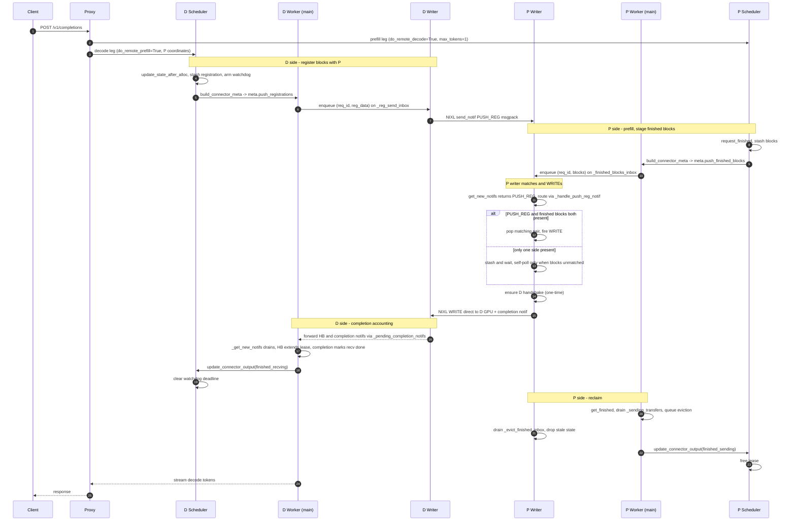

# NIXL の push モードによる KV 転送 { #nixl-push-mode-kv-transfer }

既定の NIXL コネクタは **pull ベース**です。プレフィルが完了したあと、デコード側（D）のインスタンスが `NIXL READ` でプレフィル側（P）のインスタンスから KV ブロックを読み出します。`NixlPushConnector` は **push ベース**の代替手段を追加するもので、P が `NIXL WRITE` によって KV ブロックを D の事前確保済みメモリへ直接書き込みます。

このドキュメントでは、push 方式に固有のスレッド構成、キュー、スケジューリングの相互作用を説明します。pull モードの設計は変更されていません。push コネクタは、可能な限り同じハンドシェイク、NIXL エージェントのセットアップ、メタデータの経路を再利用します。

## 全体の流れ { #high-level-flow }



## スレッド { #threads }

``NixlPushConnectorWorker`` は、ワーカーごと（つまり TP ランクごと）に ``nixl-push-writer`` という名前の専用バックグラウンドスレッドを 1 つ導入します。各スレッドは、自身のランクにおける push 固有の新しい NIXL 操作を担当します。

* ``nixl_wrapper.get_new_notifs()`` — 通知を受け取ります。
* ``nixl_wrapper.send_notif(...)`` — ``PUSH_REG:<msgpack>``（D 側）と、WRITE ごとの完了通知（P 側）を送ります。
* ``nixl_wrapper.make_prepped_xfer(...) / transfer(...)`` — WRITE 自体を発行します。

ハートビートは引き続き、``start_load_kv`` 内の既存の基底ワーカーの ``_send_heartbeats`` の仕組みを通じて、エンジンのメインスレッドから送信されます。

### 起床モデル { #wake-model }

ライタースレッドは、処理すべき作業がないときは ``_push_writer_wake``（``threading.Event``）でブロックします。このイベントをセットするのは次の 3 か所です。

1. **``start_load_kv``**（ワーカーのメインスレッド。スケジューラのメタデータとともにエンジンのステップごとに 1 回呼ばれます）— そのステップが実際にライターへ新しい作業を渡すとき、つまり ``meta.push_registrations`` または ``meta.push_finished_blocks`` が空でないときにのみ起床させます。これは新しい転送のための起床です。
2. **``get_finished``**（ワーカーのメインスレッド。完了を報告するためにエンジンのステップごとに 1 回呼ばれます）— 常に起床させます。push では ``nixl_wrapper.get_new_notifs()`` の唯一の消費者がライターであるため、処理すべき新しいメタデータがない場合でも、受信した通知（D からのハートビート、WRITE 後の完了通知、遅れて届いた ``PUSH_REG``）を処理する機会を与えます。
3. **ハンドシェイク完了のコールバック**（バックグラウンドのハンドシェイク実行スレッド）— 遅延された D→P のハンドシェイクが成功して完了すると、future の done コールバックが登録情報を ``_reg_send_inbox`` に再度キューイングし、対応する ``send_notif`` がライター上で実行されるように起床させます（``send_notif`` を実行スレッドから呼ぶことは決してありません）。この 2 回目の処理では ``_ensure_handshake`` は ``None`` を返す（エージェントはすでに接続済み）ため、ライターは直接 ``PUSH_REG`` を送ります。ハンドシェイクが*失敗*した場合、コールバックは再キューイングせずリクエストを失敗させるため、リトライループにはなりません。

イベント駆動の起床に加えて、ライターは、対応する ``PUSH_REG`` がまだ届いていない P 側の完了ブロックがある間、``_PUSH_WRITER_POLL_INTERVAL_MS = 1.0`` ミリ秒の間隔で自己ポーリングします。

P 側でリクエストが完了すると（リースの期限切れ、または WRITE の完了）、``get_finished`` がリクエスト ID を ``_evict_finished_inbox`` にキューイングします。ライターはこれを処理して、古い ``_push_finished_blocks`` / ``_pending_d_registrations`` を破棄し、自己ポーリングを停止します。

## ライターのローカルなマッチングテーブル { #writer-local-matching-tables }

| テーブル                          | 所有者            | 保持する内容                                                                  |
|--------------------------------|------------------|------------------------------------------------------------------------|
| `_pending_d_registrations`     | ライター           | リモートの D から受け取った D の登録情報。P 側のブロックを待っている状態       |
| `_push_finished_blocks`        | ライター           | スケジューラがステージングした P のブロック。リモートの D の登録情報を待っている状態  |

どちらの側が先に到着することもあります。ライターは双方向にマッチングを行います。``PUSH_REG`` が届いたら ``_push_finished_blocks`` を検索し、完了ブロックが届いたら ``_pending_d_registrations`` を検索します。どちらの検索も、まず ``request_id`` の完全一致を試み、次に（``get_base_request_id`` を使って）末尾のエンジンごとのランダムな接尾辞を取り除いた ID で比較します。このフォールバックが必要なのは、プロキシが両方の脚に同じ ``X-Request-Id`` を渡すため、P と D はそれを同じ ``cmpl-<uuid>-<index>`` の形に包み、``input_processor.assign_request_id`` がエンジンごとに付加する 8 桁の 16 進のランダム化接尾辞だけが異なるからです。この接尾辞だけを取り除けば、completion のインデックスを保ったまま（複数プロンプトのサブリクエストが区別されたまま）両者の ID を同じ形に正規化できます。また、この方法は ``VLLM_DISABLE_REQUEST_ID_RANDOMIZATION`` の設定有無にかかわらず機能します。この環境変数は上流で削除が予定されているため、この点は重要です。

## ワイヤ形式 { #wire-format }

push の登録情報は NIXL の通知として送られます。

```text
PUSH_REG:<msgpack-encoded dict>
```

辞書のフィールドは次のとおりです。

| フィールド                | 設定側 | 意味                                                                |
|----------------------|--------|------------------------------------------------------------------------|
| ``request_id``       | D      | D 自身の vLLM のリクエスト ID。P 側のマッチングキーであり、完了通知でもそのまま返されます |
| ``decode_engine_id`` | D      | D のエンジン ID（P が逆方向のハンドシェイクに使います）                  |
| ``decode_host``      | D      | D の NIXL サイドチャンネルのホスト                                             |
| ``decode_port``      | D      | D の NIXL サイドチャンネルのポート                                             |
| ``decode_tp_size``   | D      | D のテンソル並列サイズ                                               |
| ``local_block_ids``  | D      | D の *論理* ブロック ID のグループごとのリスト（事前確保済み）              |
| ``remote_engine_id`` | D      | P のエンジン ID（既存の P 側ハンドシェイク用）                      |
| ``remote_host``      | D      | P の NIXL サイドチャンネルのホスト                                             |
| ``remote_port``      | D      | P の NIXL サイドチャンネルのポート                                             |
| ``remote_tp_size``   | D      | P のテンソル並列サイズ                                               |

D は**論理**ブロック ID を送り、P は NIXL のハンドシェイク中に得た比率（`remote_physical_blocks_per_logical`）を使って、WRITE の発行時にそれを物理ブロック ID へ展開します。これは pull モードの取り決めと同じです。スケジューラは論理 ID を送り、ワーカーが発行時に物理 ID へ展開します。

WRITE のあとに P から D へ送られる完了通知は、pull モードで使われている既存の `<request_id>:<tp_size>` の形式です（ここでの ``request_id`` は登録情報から取得した D 自身のリクエスト ID）。そのため、D 側の集計コードは変更されていません。

## スケジューラ側の責務 { #scheduler-side-responsibilities }

`NixlPushConnectorScheduler` は基底のスケジューラを次のように拡張します。

* **D 側** — `update_state_after_alloc` が登録データを `_push_pending_registrations` に保存し、ソフトなウォッチドッグ（`_push_registration_deadlines`）を設定します。`build_connector_meta` はその保存内容を `meta.push_registrations` へ流し込み、期限切れのエントリは警告とともに破棄されます。
* **P 側** — `request_finished` がブロック ID を `_finished_request_blocks`（リースおよび `has_pending_push_work` 用）と `_newly_finished_push_blocks`（`meta.push_finished_blocks` を通じて次のワーカーステップで使う用）に保存します。
* **両側** — `has_pending_push_work` は、処理中の push の状態がある間エンジンのメインループを回し続けるため、ライターはステップごとに最低 1 回は起床します。

`update_connector_output` の挙動:

* `finished_sending`（P 側）はリースのエントリをクリアします。
* `finished_recving`（D 側）はウォッチドッグの期限をクリアします。

## タイムアウトとウォッチドッグ { #timeouts-and-watchdogs }

スケジューラでは、リクエストごとに 2 つのタイマーが設定されます。

* **D 側の登録ウォッチドッグ** — ``_push_registration_deadlines``。登録済みのリクエストが ``push_registration_timeout`` 秒（既定は ``decoder_kv_blocks_ttl``）以内に push の完了を確認できない場合、``build_connector_meta`` は古い登録情報と保留中のエントリを破棄し、警告をログに出して、登録情報の再送をやめます。対応するリクエストは ``_reqs_need_recv`` で引き続き追跡されます。最終的にそのリクエストを失敗させるのは、エンジンのリクエストレベルの中断経路（またはユーザー / プロキシによる HTTP 呼び出しのタイムアウト）です。
* **P 側のブロックリース** — pull モードと同じ ``_kv_lease_duration`` を使います。``request_finished`` が ``_reqs_need_send`` に期限を設定し、WRITE が成功すると ``update_connector_output(finished_sending=...)`` がそれをクリアします。期限切れのリースは基底ワーカーの ``get_finished`` が回収し、続いて ``_evict_finished_inbox`` に破棄をキューイングするため、ライターも自己ポーリングを停止します。

## 障害時の扱い { #failure-handling }

* **D 側のハンドシェイク失敗（PUSH_REG 送信前の P→D ハンドシェイク）** — future の done コールバックが ``_handle_failed_transfer(rid, None)`` を呼び、D の事前確保済みブロックを無効としてマークし、``_failed_recv_reqs`` にキューイングします。これにより、次の ``get_finished`` がそのリクエストを受信失敗として報告します。受信側の集計は pull モードと同じです。
* **PUSH_REG を P へ送る際の D 側の ``send_notif`` の失敗** — 同じ扱いです。``_handle_failed_transfer`` が受信を失敗としてマークします。
* **P 側の WRITE 発行の失敗** — WRITE のハンドル（あれば）が解放され、``xfer_stats.record_failed_transfer()`` が失敗カウンタを増やします。ここで意図的に ``_handle_failed_transfer`` は呼びません。P 側の ``req_id`` は ``_recving_metadata`` にエントリを持たない（P は受信側ではない）ため、このヘルパーは P ローカルのリクエスト ID を ``_failed_recv_reqs`` に入れてしまい、基底ワーカーの ``get_finished`` のアサーションに引っかかるからです。送信側の WRITE はそのまま破棄され、完了が届かない件は D 側のリースのウォッチドッグが処理します。

## まとめ { #summary }

push 方式は、既存の NIXL コネクタの上に載る、小さくよくまとまった拡張です。

* 新しいコネクタクラス 1 つ、新しいスケジューラクラス 1 つ、新しいワーカークラス 1 つ。いずれも既存の基底クラスのサブクラスです。
* ワーカーごとに専用のバックグラウンドスレッド 1 つ。
* いくつかのスレッド間キュー。それぞれ消費者は 1 つ（ライター）です。ほとんどは生産者も 1 つですが、``_reg_send_inbox`` だけはエンジンのメインスレッド（新しい登録情報）とハンドシェイク完了のコールバック（D→P のハンドシェイク完了後に再投入される登録情報）の両方から供給されます。
* 新しい通知の型 1 つ（`PUSH_REG:<msgpack>`）。

これ以外の点で、エンジンのメインスレッドの挙動は変わりません。ライタースレッドはイベント駆動で、push の作業がないときはアイドル状態です。
