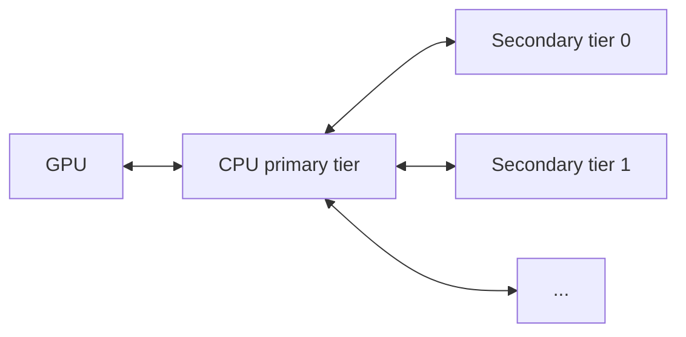

# KV オフロード利用ガイド { #kv-offloading-usage-guide }

このガイドでは、[`OffloadingConnector`](disagg_prefill.md) の設定について説明します。このコネクタは、完成した KV ブロックを生成のたびに、より低速だが容量の大きい階層（CPU のホストメモリと、任意の二次階層）へオフロードすることで、プレフィックスキャッシュを拡張します。オフロード階層でヒットしたブロックは、必要に応じて GPU へ引き上げられます。GPU と CPU の間の転送には DMA（`cudaMemcpyAsync`）が使われ、モデルの計算と並行して非同期に実行されるため、オフロードによる CPU / GPU コアのオーバーヘッドはごくわずかです。

!!! note
    `OffloadingConnector` は現時点で CUDA、ROCm、XPU のみをサポートしています。

## 概要 { #overview }

`kv_connector_extra_config` の `spec_name` キーで選択できる spec が 2 つあります。

- `CPUOffloadingSpec`（既定）: 単一の CPU 階層。完成した GPU のブロックが pinned なホストメモリにコピーされます。
- `TieringOffloadingSpec`: 多階層。CPU の一次階層に加えて、1 つ以上の二次階層を持ちます。

GPU に直接アクセスできるのは CPU の一次階層だけです。二次階層は GPU メモリを読み書きできず、GPU と二次階層の間の転送はすべて CPU の一次階層を経由します。



## 単一階層の構成（CPU のみ） { #single-tier-setup-cpu-only }

```bash
vllm serve <model> \
  --kv-transfer-config '{
    "kv_connector": "OffloadingConnector",
    "kv_role": "kv_both",
    "kv_connector_extra_config": {
      "block_size": 64,
      "cpu_bytes_to_use": 1000000000
    }
  }'
```

## 多階層の構成 { #multi-tier-setup }

`spec_name` を `"TieringOffloadingSpec"` に設定し、`secondary_tiers` のリストを指定します。各エントリは、必須の `type` キーと階層固有のフィールドを持つ辞書です。このリストには順序があり、階層 0 が階層 1 より先に参照されます。階層固有のキーについては[二次階層](#secondary-tiers)を参照してください。

```bash
vllm serve <model> \
  --kv-transfer-config '{
    "kv_connector": "OffloadingConnector",
    "kv_role": "kv_both",
    "kv_connector_extra_config": {
      "spec_name": "TieringOffloadingSpec",
      "cpu_bytes_to_use": 10737418240,
      "block_size": 16,
      "eviction_policy": "lru",
      "secondary_tiers": [
        {
          "type": "fs",
          "root_dir": "/mnt/kv_cache",
          "n_read_threads": 32,
          "n_write_threads": 16
        }
      ]
    }
  }'
```

## `kv_connector_extra_config` のリファレンス { #kv_connector_extra_config-reference }

| キー | 必須 | 既定値 | 適用範囲 | 備考 |
| --- | --- | --- | --- | --- |
| `spec_name` | いいえ | `CPUOffloadingSpec` | 両方 | 多階層にするには `TieringOffloadingSpec` を設定します。 |
| `cpu_bytes_to_use` | はい | — | 両方 | CPU 階層のために確保するホストメモリの総バイト数（全ワーカー合計であり、ワーカーごとではありません）。 |
| `block_size` | いいえ | GPU のブロックサイズ | 両方 | オフロードするブロックのサイズ（トークン単位）。GPU のブロックサイズの倍数である必要があります。 |
| `eviction_policy` | いいえ | `lru` | 両方 | 一次階層のポリシー: `lru` または `arc`。 |
| `store_threshold` | いいえ | `0` | 単一階層 | ブロックがオフロードされるまでに必要な最小の参照回数。2 以上の値は `TieringOffloadingSpec` では拒否されます。 |
| `max_tracker_size` | いいえ | `64000` | 単一階層 | 参照トラッカーの最大エントリ数。 |
| `secondary_tiers` | いいえ | `[]` | 多階層 | 二次階層の設定のリスト（後述）。 |
| `offload_prompt_only` | いいえ | `true` | 両方 | `true` の場合、プロンプト（プレフィル）のブロックのみがオフロードされ、デコードのブロックはスキップされます。 |
| `self_describing_kv_events` | いいえ | `false` | 単一階層 | オプトインの設定です。`true` で*かつ* KV キャッシュイベントが有効（`--kv-events-config` の `enable_kv_cache_events`）な場合、コネクタはプレースホルダーのフォールバックではなく、自己記述的でブロック粒度の `BlockStored` / `BlockRemoved` のペイロード（構成ブロックのハッシュ、チャンク全体の `token_ids`、ブロックごとの `block_size`、親のハッシュ、LoRA およびグループ / キャッシュ spec のメタデータ）を発行します。これにより、外部の KV イベント consumer がオフロード済みブロックを索引できます。イベントが有効でない限り何も起こりません。現時点では `TieringOffloadingSpec` では拒否されます。full attention のグループのみが対象で、sliding-window / SSM のグループはプレースホルダーのフォールバックのままです。チャンクモード（`block_size` が GPU のブロックサイズより大きい場合）では、重なり合うチャンクが共有のブロックごとハッシュを再度通知するため、consumer 側で繰り返しの保存 / 削除の通知を参照カウント（重複排除）する必要があります。 |
| `spec_module_path` | いいえ | — | 両方 | 組み込みのレジストリにないカスタムの `OffloadingSpec` の Python の import パス。`spec_name` が組み込みでない場合にのみ必要です（上級者向け）。 |

## 二次階層 { #secondary-tiers }

`secondary_tiers` の各エントリは、必須の `type` フィールドと階層固有のフィールドを持つ辞書です。

ファイルシステム階層とオブジェクトストア階層は、正常に保存したブロックについて、階層ごとに安定した `medium`（ファイルシステム階層は `FS`、オブジェクトストア階層は `OBJ`）を付けたハッシュのみの `BlockStored` の KV イベントを発行できます。オプトインするには、その階層のエントリで `enable_kv_events: true` を設定します。イベントが発行されるのは、`--kv-events-config` によって KV キャッシュイベントが全体としても有効になっている場合のみです。

任意の `locality` フィールドに `LOCAL` または `REMOTE` を設定すると、発行元の vLLM インスタンスから見たその階層のストレージの位置を表せます。`LOCAL` はそのインスタンスにとってローカルなストレージを、`REMOTE` はローカルでないストレージを表します。この設定を省略した場合、locality は未指定になります。vLLM は階層の種類からこれを推測しないため、OBJ の階層が暗黙に `REMOTE` になることはありません。KV イベントに `locality` が含まれるのは、その階層で明示的に設定した場合のみです。このメタデータは階層の性質を表すだけで、consumer がすでにそのブロックへリクエストをルーティングできることを意味するものではありません。

### ファイルシステム（FS） { #filesystem-fs }

ファイルシステム階層（`type: "fs"`）は、ブロックをファイルシステムのディレクトリに書き込みます。

| キー | 必須 | 既定値 | 備考 |
| --- | --- | --- | --- |
| `type` | はい | — | `fs` である必要があります。 |
| `root_dir` | はい | — | ベースとなるディレクトリ。vLLM はその下にサブディレクトリを作成します（[ディスク上のレイアウト](#on-disk-layout)を参照）。 |
| `n_read_threads` | いいえ | `16` | 読み取り優先の I/O スレッド数（読み込み経路）。 |
| `n_write_threads` | いいえ | `16` | 書き込み優先の I/O スレッド数（保存経路）。 |
| `enable_kv_events` | いいえ | `false` | 正常に保存したブロックについて `BlockStored` の KV イベント（medium は `FS`）を発行します。KV キャッシュイベントが全体で有効になっている必要があります。 |
| `locality` | いいえ | 未指定 | 発行元の vLLM インスタンスから見た `LOCAL` または `REMOTE`。明示的に設定した場合のみ、その階層の KV イベントに含まれます。 |

各スレッドグループは自分のキューを優先しますが、自分のキューが空のときはもう一方から取ってきます。そのため、書き込みや読み取りが集中しても、優先度の低い側のキューが待たされたままにはなりません。合計スレッド数は、ストレージが実際に処理できる並行度に合わせて設定してください。

#### ディスク上のレイアウト { #on-disk-layout }

`root_dir` の下に、vLLM は `<model>_<digest>` というサブディレクトリを作成します。`<model>` はモデル名の `/` を `_` に置き換えたもので（`meta-llama/Llama-3-8B` のような HuggingFace の ID がネストしないようにするため）、`<digest>` は実行時の構成（モデル、ブロックサイズ、並列構成、dtype など）から導かれる短い SHA256 の接頭辞です。同じ構成の実行は同じサブディレクトリを共有し、異なる構成の実行は同じ `root_dir` の下で衝突せずに並存します。

そのサブディレクトリ内では、ディレクトリのファンアウトを抑えるため、ブロックがハッシュの接頭辞ごとのサブディレクトリに分散されます。

```text
<root_dir>/
  <model>_<digest>/
    config.json
  <model>_<digest>_r<rank>/
    <hhh>/                    # first 3 hex chars of the block hash
      <hh>_g<group_idx>/      # next 2 hex chars + KV cache group index
        <hash_hex>.bin        # full block hash (in hex)
```

`config.json` には実行内容（ブロックサイズ、KV グループ数など）が記録され、初回起動時に書き込まれます。各ランクは自分専用の `_r<rank>` という兄弟ディレクトリの下にブロックを書き込むため、複数のランクが同じ `root_dir` を安全に共有できます。

#### プロセス間での共有 { #cross-process-sharing }

同じ `root_dir` を使う複数の vLLM インスタンス間で（共有 PVC などを介して）KV キャッシュを共有するには、すべてのインスタンスで環境変数 `PYTHONHASHSEED` を同じ固定値（`"0"` など）に設定する必要があります。設定しない場合、各プロセスが `NONE_HASH`（ブロック内容のハッシュのためのチェーンハッシュのシード）をランダムなバイト列で初期化するため、同一のトークン内容でも異なるブロックのファイル名が生成されてしまいます。

```bash
PYTHONHASHSEED=0 vllm serve ...
```

### オブジェクトストア（OBJ） { #object-store-obj }

オブジェクトストア階層（`type: "obj"`）は、NIXL の OBJ バックエンドを通じて S3 互換のオブジェクトストアへブロックをオフロードします。

| キー | 必須 | 既定値 | 備考 |
| --- | --- | --- | --- |
| `type` | はい | — | `obj` である必要があります。 |
| `store_config` | はい | — | オブジェクトストアへの接続パラメータ（後述）。 |
| `prefix` | いいえ | `""` | すべてのオブジェクトキーの先頭に付けるプレフィックス。 |
| `io_threads` | いいえ | `4` | NIXL の OBJ バックエンドの I/O スレッド数。 |
| `enable_kv_events` | いいえ | `false` | 正常に保存したブロックについて `BlockStored` の KV イベント（medium は `OBJ`）を発行します。KV キャッシュイベントが全体で有効になっている必要があります。 |
| `locality` | いいえ | 未指定 | 発行元の vLLM インスタンスから見た `LOCAL` または `REMOTE`。明示的に設定した場合のみ、その階層の KV イベントに含まれます。OBJ であることが `REMOTE` を意味するわけではありません。 |

`store_config` のフィールド:

| キー | 必須 | 既定値 | 備考 |
| --- | --- | --- | --- |
| `bucket` | はい | — | バケット名。 |
| `endpoint_override` | はい | — | オブジェクトストアのエンドポイントのホスト。URL のスキームは `scheme` で別途指定します。 |
| `scheme` | いいえ | `http` | `http` または `https`。 |
| `access_key`、`secret_key`、`session_token` | いいえ | `""` | 明示的な認証情報。空のままにすると、NIXL の OBJ プラグインは AWS SDK の既定の認証情報プロバイダチェーン（IAM ロール、環境変数、認証情報ファイル）にフォールバックします。これにより Kubernetes 上でワークロード ID による認証が可能になります。 |
| `region` | いいえ | `""` | エンドポイントが要求する場合のバケットのリージョン。 |
| `ca_bundle` | いいえ | `""` | TLS 検証のための CA バンドルのパス。 |

オブジェクトキーは、ファイルシステム階層と同じ実行構成のダイジェスト方式に従い（[ディスク上のレイアウト](#on-disk-layout)を参照）、任意の `prefix` の下に保存されます。[プロセス間での共有](#cross-process-sharing)の要件（`PYTHONHASHSEED`）は共有バケットにも当てはまり、バケットを共有するインスタンスは同一の内容に対して同一のキーを生成します。起動時、この階層はオブジェクトストアへの接続性を確認し、バケットに到達できない場合は設定エラーで即座に失敗します。

### P2P（P/D を含む） { #p2p-including-pd }

P2P 階層（`type: "p2p"`）は、NIXL を介した RDMA によって、vLLM インスタンス間で完成した KV ブロックを共有します。各インスタンスは `host:port` に制御用ソケットをバインドし、ピアと直接ブロックをやり取りします。共有ファイルシステムは不要です。

すべてのノードで環境変数 PYTHONHASHSEED を同じ固定値に設定する必要があります。

| キー | 必須 | 既定値 | 備考 |
| --- | --- | --- | --- |
| `type` | はい | — | `p2p` である必要があります。 |
| `host` | いいえ | `$VLLM_P2P_SIDE_CHANNEL_HOST`（`localhost`） | 制御用ソケットをバインドするアドレス。ピアが接続し返す際の識別子としてそのまま使われます。省略した場合は後述の環境変数から解決されます。既定の `localhost` はループバックにのみバインドするため、ホストをまたぐ P2P では**必ず**ノードのルーティング可能な IP を設定してください（後述）。 |
| `port` | いいえ | `$VLLM_P2P_SIDE_CHANNEL_PORT`（`5710`） | 制御用ソケットのベースポート。ピアから到達可能である必要があります。実際にバインドされるポートは `base + data_parallel_index` です（DP レプリカごとに 1 ソケット）。省略した場合、ベース値は後述の環境変数から解決されます。 |
| `backends` | いいえ | `["UCX"]` | NIXL のトランスポートバックエンド。利用可能なバックエンドと選択の指針は [NixlConnector 利用ガイド](nixl_connector_usage.md#selecting-a-nixl-transport-backend-plugin)を参照してください。 |
| `num_threads` | いいえ | `4` | NIXL エージェントのワーカースレッド数。`backends` が UCX のみの場合にだけ使われ、UCX 以外のバックエンドが指定されている場合は無視されます。 |

`backends` と `num_threads` のオプションは、[`NixlConnector`](nixl_connector_usage.md#selecting-a-nixl-transport-backend-plugin) が使う条件分岐と同じ挙動になります。UCX 以外のバックエンドが設定されている場合、NIXL は `backends=...` で初期化されます。そうでない場合は、設定された `num_threads` を持つ UCX のみのエージェントにフォールバックします。これにより、P2P 階層は同じプロセスで動作するメインの `NixlConnector` とは異なるトランスポート（`MOONCAKE`、`GDS_MT`、`LIBFABRIC` など）を使えます。

#### 環境変数 { #environment-variables }

`secondary_tiers` の各エントリに `host` / `port` を埋め込む代わりに、デプロイ時に環境変数で一度だけ設定できます（`VLLM_NIXL_SIDE_CHANNEL_HOST` / `VLLM_NIXL_SIDE_CHANNEL_PORT` と同様）。設定に明示的な `host` / `port` のキーがある場合はそちらが優先されます。

- `VLLM_P2P_SIDE_CHANNEL_HOST`（既定 `localhost`）: P2P の制御用ソケットがバインドするアドレス。バインドアドレスとしても、ピアが接続し返す識別子としても**そのまま**使われ、自動検出は行われません（`VLLM_NIXL_SIDE_CHANNEL_HOST` と同じ挙動です）。既定ではループバックインターフェースにのみバインドするため、別ホストのピアからは到達できません。**ホストをまたぐ P2P のデプロイでは、`vllm serve` を起動する前に、ノードのルーティング可能な IP（Pod の IP など）を明示的に設定してください。** そうしないとリモートのピアは接続に失敗します。NIXL のエージェント名はプロセスごとの別の識別子であるため、`host:port` を共有するピア同士が衝突することはありません。
- `VLLM_P2P_SIDE_CHANNEL_PORT`（既定 `5710`）: P2P の制御用ソケットのベースポート。実際にバインドされるポートは `VLLM_P2P_SIDE_CHANNEL_PORT + data_parallel_index` で、NIXL と同様に DP レプリカごとに 1 ソケットとなります（DP=1 の場合オフセットは 0）。ピアのポートは `kv_transfer_params` の `remote_port` として渡されます。DP ランクを選択するルーター / EPP（`X-data-parallel-rank` ヘッダーなど）が `remote_port = base + rank` を計算します。DP インデックスのオフセットは 1 つのデプロイ*内*のレプリカを区別するものです。同じホストに配置された 2 つの*デプロイ*（プレフィル側とデコード側）では、バインドの衝突を避けるために別々のベースポート（デコード側は `5711` など）が必要です。

## チューニングのヒント { #tuning-tips }

- `cpu_bytes_to_use`: CPU 階層を大きくすると、より遅い二次階層へのアクセスが減り、ヒット率が上がります。この値は全ワーカーの合計であり、ワーカーごとではありません。ホスト上の他のワークロードのために余裕を残してください。
- 単一階層（CPU のみ）の構成では、`cpu_bytes_to_use` を GPU の KV キャッシュの合計より大きく設定してください。オフロードは即座に行われるため、CPU 階層が小さいと GPU がすでに保持している内容を写すだけになり、ヒット率は向上しません。
- `block_size`: オフロードするブロックを大きくすると、ブロックごとの管理オーバーヘッドは減りますが、参照の粒度は粗くなります。GPU のブロックサイズの倍数である必要があります。
- FS のスレッド数: `n_read_threads` と `n_write_threads` を、ストレージが維持できる並行度に合わせて調整してください。プレフィル経路での読み取りはレイテンシに敏感なので、プレフィルのヒット率が高い場合は読み取りスレッドを多めにするとよいでしょう。
- 実行間での `root_dir` の共有: モデル、`block_size`、並列構成、dtype が同じ実行は、同じ `<digest>` のサブディレクトリの下でファイルを共有します。いずれかを変更すると新しいサブディレクトリが作られ、古いものは孤立しますが害はありません。ディスクを取り戻すには削除してください。

## リクエストごとの選択的オフロード { #per-request-selective-offload }

個々のリクエストは、`kv_transfer_params` に `max_offload_tokens` を設定することで、オフロード対象となるトークン数の上限を指定できます。オフロードされるのはリクエストの先頭から `max_offload_tokens` トークンまでで、それ以降のブロックは保存経路でスキップされます。これは、既知のプレフィックス（システムプロンプトや共有コンテキストなど）はキャッシュする価値があるが、その後のリクエスト固有のトークンはそうでない、という場合に有用です。

| キー | 型 | 備考 |
| --- | --- | --- |
| `max_offload_tokens` | 非負の `int` | このリクエストでオフロードするトークン数の上限。`0` にするとそのリクエストのオフロードが完全に無効になります。上限を設けない場合はキーを省略します（または `None` を設定します）。`int` 以外、負の値、`bool` の値は警告とともに拒否され、上限なしとして扱われます。 |

!!! note
    `max_offload_tokens` は実験的な機能であり、変更される可能性があります。

例（OpenAI 互換の completions リクエスト）:

```json
{
  "model": "<model>",
  "prompt": "...",
  "kv_transfer_params": {
    "max_offload_tokens": 1024
  }
}
```

## さらに読む { #further-reading }

- [vLLM blog: KV Offloading Connector](https://vllm.ai/blog/2026-01-08-kv-offloading-connector) — 動機、アーキテクチャ（DMA ベースの非同期転送）、ベンチマーク（TTFT とスループット）。
