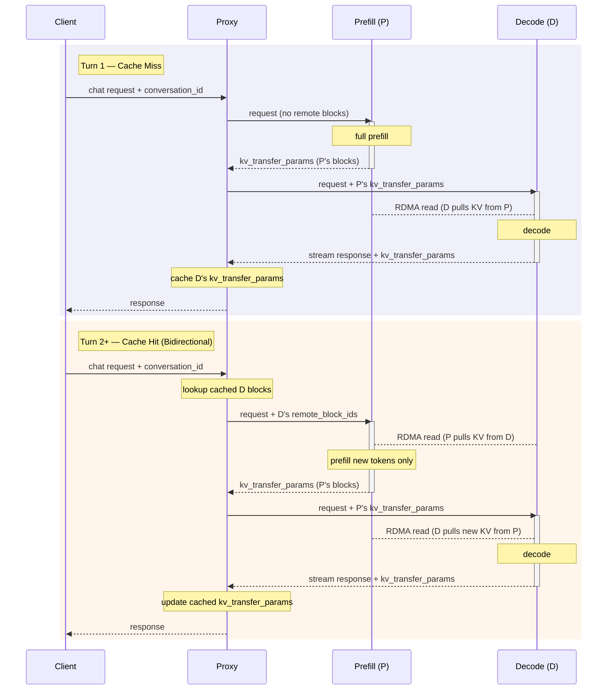

# NixlConnector 利用ガイド { #nixlconnector-usage-guide }

NixlConnector は、vLLM のプレフィル分離機能向けの高性能な KV キャッシュ転送コネクタです。NIXL ライブラリを使い、完全に非同期な送受信でプロセス間の KV キャッシュ転送を効率的に行います。

機能の互換性の詳細（サポートされるモデルアーキテクチャ、TP 構成、機能同士の相互作用）については、[NixlConnector 互換性マトリクス](nixl_connector_compatibility.md)を参照してください。

## 前提条件 { #prerequisites }

### インストール { #installation }

NVIDIA プラットフォームで手早く始めるには、NIXL ライブラリをインストールします: `uv pip install nixl`

- インストール手順の詳細は [NIXL 公式リポジトリ](https://github.com/ai-dynamo/nixl)を参照してください
- 必要な NIXL のバージョンは [requirements/kv_connectors.txt](../../requirements/kv_connectors.txt) やその他の関連する設定ファイルで確認できます

ROCm プラットフォームでは、[ROCm の Dockerfile](../../docker/Dockerfile.rocm) にすでに RIXL と ucx が含まれています。

- 詳細は [RIXL 公式リポジトリ](https://github.com/rocm/rixl)を参照してください
- RIXL がサポートするライブラリは [requirements/kv_connectors_rocm.txt](../../requirements/kv_connectors_rocm.txt) で確認できます
- 将来的には Docker イメージから RIXL を外し、コンパイル済みのバイナリパッケージからインストールできるようにする可能性があります

CUDA 以外のプラットフォームでは、以下の手順に従い ucx をソースからビルドして nixl をインストールしてください。

```bash
python tools/install_nixl_from_source_ubuntu.py
```

### トランスポートの設定 { #transport-configuration }

NixlConnector は下位の通信に NIXL ライブラリを使い、複数のトランスポートバックエンドをサポートします。NIXL が使う既定の主要トランスポートライブラリは UCX（Unified Communication X）です。トランスポートの環境変数は次のように設定します。

```bash
# Example UCX configuration, adjust according to your environment
export UCX_TLS=all  # or specify specific transports like "rc,ud,sm,^cuda_ipc" ..etc
export UCX_NET_DEVICES=all  # or specify network devices like "mlx5_0:1,mlx5_1:1"
```

!!! tip
    トランスポートバックエンドとして UCX を使う場合、NCCL の環境変数（`NCCL_IB_HCA`、`NCCL_SOCKET_IFNAME` など）は NixlConnector には適用されません。NCCL の変数ではなく UCX 固有の環境変数を設定してください。

#### NIXL のトランスポートバックエンド（プラグイン）の選択 { #selecting-a-nixl-transport-backend-plugin }

NixlConnector は異なる NIXL のトランスポートバックエンド（プラグイン）を利用できます。既定では UCX がトランスポートバックエンドとして使われます。

別のバックエンドを選択するには、`--kv-transfer-config` で `kv_connector_extra_config.backends` を設定します。

### 例: LIBFABRIC バックエンドを使う { #example-using-libfabric-backend }

```bash
vllm serve <MODEL> \
  --kv-transfer-config '{
    "kv_connector":"NixlConnector",
    "kv_role":"kv_producer",
    "kv_connector_extra_config":{"backends":["LIBFABRIC"]}
  }'
```

ドット記法の引数で JSON のキーを個別に渡すこともできます。また、`+` を使ってリストに要素を追加できます。

```bash
vllm serve <MODEL> \
  --kv-transfer-config.kv_connector NixlConnector \
  --kv-transfer-config.kv_role kv_producer \
  --kv-transfer-config.kv_connector_extra_config.backends+ LIBFABRIC
```

!!! note
    利用できるバックエンドは、NIXL のビルド方法と環境に存在するプラグインによって決まります。利用可能なバックエンドとビルド手順は [NIXL リポジトリ](https://github.com/ai-dynamo/nixl)を参照してください。

## 基本的な使い方（同一ホスト上） { #basic-usage-on-the-same-host }

### プロデューサ（プレフィル側）の設定 { #producer-prefiller-configuration }

KV キャッシュを生成するプレフィルのインスタンスを起動します。

```bash
# 1st GPU as prefiller
CUDA_VISIBLE_DEVICES=0 \
UCX_NET_DEVICES=all \
VLLM_NIXL_SIDE_CHANNEL_PORT=5600 \
vllm serve Qwen/Qwen3-0.6B \
  --port 8100 \
  --enforce-eager \
  --kv-transfer-config '{"kv_connector":"NixlConnector","kv_role":"kv_producer","kv_load_failure_policy":"fail"}'
```

### コンシューマ（デコード側）の設定 { #consumer-decoder-configuration }

KV キャッシュを消費するデコードのインスタンスを起動します。

```bash
# 2nd GPU as decoder
CUDA_VISIBLE_DEVICES=1 \
UCX_NET_DEVICES=all \
VLLM_NIXL_SIDE_CHANNEL_PORT=5601 \
vllm serve Qwen/Qwen3-0.6B \
  --port 8200 \
  --enforce-eager \
  --kv-transfer-config '{"kv_connector":"NixlConnector","kv_role":"kv_consumer","kv_load_failure_policy":"fail"}'
```

### プロキシサーバー { #proxy-server }

プレフィル側とデコード側のあいだでリクエストをルーティングするために、プロキシサーバーを使います。

```bash
python tests/v1/kv_connector/nixl_integration/toy_proxy_server.py \
  --port 8192 \
  --prefiller-hosts localhost \
  --prefiller-ports 8100 \
  --decoder-hosts localhost \
  --decoder-ports 8200
```

## 環境変数 { #environment-variables }

- `VLLM_NIXL_SIDE_CHANNEL_PORT`: NIXL のハンドシェイク通信に使うポート
    - 既定値: 5600
    - **プレフィル側とデコード側の両方のインスタンスで必要です**
    - 各 vLLM ワーカーは、自身のホスト上で一意なポートを必要とします。ホストが異なれば同じポート番号を使っても構いません
    - TP / DP でのデプロイでは、ノード上の各ワーカーのポートは base_port + dp_rank として計算されます（たとえば `--data-parallel-size=2` で base_port=5600 の場合、dp_rank 0〜1 はそのノードでポート 5600、5601 を使います）
    - プレフィル側とデコード側の最初の NIXL ハンドシェイクに使われます

- `VLLM_NIXL_SIDE_CHANNEL_HOST`: サイドチャネル通信に使うホスト
    - 既定値: "localhost"
    - プレフィル側とデコード側が別のマシンにある場合に設定します
    - 接続情報は、ハンドシェイクのためにプレフィル側からデコード側へ KVTransferParams 経由で渡されます

- `kv_lease_duration`（`kv_connector_extra_config` 経由）: プレフィル側の KV キャッシュブロックのリース期間（秒）。（任意）
    - 既定値: 30
    - プレフィルのリクエストが完了すると、その KV ブロックはデコード側が読み出すのを待つあいだ、この期間だけ保持されます。リクエストがデコード側でキューに入っているあいだは、定期的なハートビートによりリースが自動的に延長されます。リースが切れるまでにハートビートも読み出し通知も届かない場合、ブロックは解放されます。ハートビートの間隔と延長量は、この値から自動的に導出されます。
    - 例: `--kv-transfer-config '{"kv_connector_extra_config": {"kv_lease_duration": 60}}'`

- `decoder_kv_blocks_ttl`（`kv_connector_extra_config` 経由）: 双方向転送モードでデコード側にキャッシュされる KV ブロックの TTL（秒）。（任意）
    - 既定値: 480
    - 双方向モードでは、デコード側がマルチターン会話のために KV ブロックをキャッシュします。この TTL は、それらのブロックを解放するまでどれだけ保持するかを制御します。プレフィル側のリースとは異なり、この TTL はハートビートで更新されません。
    - 例: `--kv-transfer-config '{"kv_connector_extra_config": {"decoder_kv_blocks_ttl": 600}}'`

## 双方向の KV 転送（マルチターン） { #bidirectional-kv-transfer-multi-turn }

標準的なプレフィル分離では、KV キャッシュは一方向に流れます。プレフィル（P）が KV キャッシュを計算し、デコード（D）が P から読み出します。マルチターン会話ではこれは無駄です。D は前のターンで生成されたトークンに対応する KV キャッシュをすでに保持しているにもかかわらず、P は新しいターンのたびにそれをゼロから再計算しなければなりません。双方向の KV 転送では、P が新しいトークンだけを計算する前に、RDMA 経由で D から既存の KV ブロックを**プル**できるため、**マルチターンが多い場面**のような長いプレフィルにおいて TTFT（最初のトークンまでの時間）を大きく短縮できます。

### 仕組み { #how-it-works }

この機能は、クライアントと P / D インスタンスのあいだに置かれる**ステートフルなプロキシ**に依存します。プロキシは各ターンの終わりに D が返す `kv_transfer_params` を追跡し、次のターンのリクエストに付加することで、P が D からどのブロックをプルすべきかを把握できるようにします。



**ターン 1（キャッシュミス）:**

1. クライアントが `conversation_id` を含むチャットリクエストをプロキシに送ります。
2. プロキシはリモートのブロック情報なしでリクエストを P に転送します。P は KV キャッシュ全体を計算します。
3. プロキシは P の `kv_transfer_params`（ブロック ID、エンジン ID、ホスト / ポート）とともにリクエストを D に転送します。
4. D は RDMA（ピアツーピアのプル）で P から KV ブロックを読み出し、応答を生成します。
5. D はプロキシを介して応答をストリーミングで返します。最後のチャンクには D 自身の `kv_transfer_params` が含まれます。
6. プロキシは D の `kv_transfer_params` を `conversation_id` をキーにキャッシュし、応答をクライアントに返します。

**ターン 2 以降（キャッシュヒット — 双方向）:**

1. クライアントが同じ `conversation_id` で次のターンを送ります。
2. プロキシは前のターンでキャッシュした `kv_transfer_params` を参照し、D の `remote_block_ids` を P へのリクエストに付加します。
3. P は RDMA（D→P のプル）で D から既存の KV キャッシュを読み出し、新しいトークンについてのみ KV を計算します。
4. プロキシは P の更新された `kv_transfer_params` とともにリクエストを D に転送します。
5. D は P から新しい KV ブロックを読み出して応答を生成し、更新された `kv_transfer_params` を返します。プロキシはこれを次のターンのためにキャッシュします。

### 設定 { #configuration }

双方向の KV 転送を有効にするには、P と D **両方の**インスタンスで `kv_connector_extra_config` に `bidirectional_kv_xfer` を設定します。

```bash
# Prefill instance
vllm serve <MODEL> \
  --kv-transfer-config '{
    "kv_connector": "NixlConnector",
    "kv_role": "kv_producer",
    "kv_connector_extra_config": {
      "bidirectional_kv_xfer": true
    }
  }'

# Decode instance
vllm serve <MODEL> \
  --kv-transfer-config '{
    "kv_connector": "NixlConnector",
    "kv_role": "kv_consumer",
    "kv_connector_extra_config": {
      "bidirectional_kv_xfer": true
    }
  }'
```

`kv_connector_extra_config` の追加の設定項目:

| パラメータ | 既定値 | 説明 |
| --------- | ------- | ----------- |
| `bidirectional_kv_xfer` | `false` | 双方向（D→P）の KV 転送を有効にします。 |
| `kv_recompute_threshold` | `64` | D→P のプルを行うために必要なリモートトークンの最小数。この閾値未満の場合、P はプルせずローカルで再計算します（転送レイテンシを償却するため）。 |
| `decoder_kv_blocks_ttl` | `480` | 双方向の再利用のために D にキャッシュされる KV ブロックの TTL（秒）。この期間を過ぎるとブロックは解放されます。ハートビートでは更新されません。 |

### マルチターン用プロキシのセットアップ { #multi-turn-proxy-setup }

会話のターンをまたぐ `kv_transfer_params` のキャッシュを管理するには、同梱のマルチターン用プロキシを使います。

```bash
python examples/disaggregated/disaggregated_serving/disagg_proxy_multiturn.py \
  --host 0.0.0.0 --port 8000 \
  --prefiller-host <P_IP> --prefiller-port 8100 \
  --decoder-host <D_IP> --decoder-port 8200
```

このプロキシは、ラウンドロビンによる複数の P / D インスタンスをサポートします。

```bash
python examples/disaggregated/disaggregated_serving/disagg_proxy_multiturn.py \
  --host 0.0.0.0 --port 8000 \
  --prefiller-hosts <P_IP1> <P_IP2> --prefiller-ports 8100 8100 \
  --decoder-hosts <D_IP1> <D_IP2> --decoder-ports 8200 8200
```

### クライアント側の使い方 { #client-usage }

ターンをまたいだ KV の再利用を有効にするには、リクエストボディに `conversation_id` フィールドを含めます。これがない場合、プロキシはターンを関連づけられず、全体の再計算にフォールバックします。

```bash
# Turn 1
curl http://localhost:8000/v1/chat/completions \
  -H "Content-Type: application/json" \
  -d '{
    "model": "Qwen/Qwen3-0.6B",
    "conversation_id": "session-42",
    "messages": [
      {"role": "user", "content": "What is vLLM?"}
    ]
  }'

# Turn 2 — same conversation_id triggers bidirectional KV pull
curl http://localhost:8000/v1/chat/completions \
  -H "Content-Type: application/json" \
  -d '{
    "model": "Qwen/Qwen3-0.6B",
    "conversation_id": "session-42",
    "messages": [
      {"role": "user", "content": "What is vLLM?"},
      {"role": "assistant", "content": "vLLM is a high-throughput LLM serving engine..."},
      {"role": "user", "content": "How does disaggregated prefilling work?"}
    ]
  }'
```

!!! note
    `conversation_id` フィールドは OpenAI API に対する非標準の拡張です。プロキシが消費し、vLLM エンジンには転送されません。

### マルチターン用プロキシのベンチマーク { #benchmarking-the-multi-turn-proxy }

[`benchmarks/multi_turn/benchmark_serving_multi_turn.py`](../../benchmarks/multi_turn/benchmark_serving_multi_turn.py) は `--send-conversation-id` フラグにより、分離構成のマルチターン用プロキシを対象にできます。このフラグは会話ごとの `conversation_id` をすべてのリクエストのペイロードに挿入し、プロキシがターンをまたいだ KV キャッシュの再利用をキー付けできるようにします。

このフラグは**既定で無効**です。未知のトップレベルフィールドを拒否する厳格な OpenAI 互換フロントエンドとの互換性を保つためです。マルチターン用プロキシをベンチマークする際は明示的に渡す必要があります。そうしないと、すべてのターンがキャッシュミスになり、双方向の KV 転送の経路がまったく使われません。

```bash
python benchmarks/multi_turn/benchmark_serving_multi_turn.py \
  --model <MODEL> --served-model-name <NAME> \
  --url http://<proxy_host>:8000 \
  --input-file benchmarks/multi_turn/generate_multi_turn.json \
  --num-clients 2 --max-active-conversations 6 \
  --send-conversation-id
```

### 制限事項 { #limitations }

- ターン間で `kv_transfer_params` を追跡・転送するステートフルなプロキシ（または同等のルーター）が必要です。
- 現時点では、デバイスバッファの KV キャッシュを使う CUDA でサポートされています。ホストバッファのサポート（Intel XPU 向けなど）は今後の作業として計画されています。

!!! warning "thinking トレースが除去された推論モデル"
    thinking トレース（`<think>...</think>`）を生成する推論モデル（DeepSeek-R1 など）を使う場合、
    D の KV ブロックは thinking トークンを含むトークン列全体をカバーします。クライアントが
    次のターンを送る前に会話履歴から thinking トレースを取り除くと、P が受け取るプロンプトは
    D が生成した内容の途中のトークンを欠くことになります。ブロックの位置合わせのロジックは
    P のプロンプトが D の列の接頭辞であることを前提としているため、この場合に D から KV ブロックを
    プルすると、誤ったトークン位置について計算されたキャッシュが転送され、不正な結果になります。

    現時点では、ルーターがこうしたターンをまたぐ不一致を検出できることを前提としています。[#43094](https://github.com/vllm-project/vllm/issues/43094) を参照してください。

## 複数インスタンスの構成 { #multi-instance-setup }

### 複数のプレフィルインスタンスを別マシンに配置する { #multiple-prefiller-instances-on-different-machines }

```bash
# Prefiller 1 on Machine A (example IP: ${IP1})
VLLM_NIXL_SIDE_CHANNEL_HOST=${IP1} \
VLLM_NIXL_SIDE_CHANNEL_PORT=5600 \
UCX_NET_DEVICES=all \
vllm serve Qwen/Qwen3-0.6B --port 8000 \
  --tensor-parallel-size 8 \
  --kv-transfer-config '{"kv_connector":"NixlConnector","kv_role":"kv_producer","kv_load_failure_policy":"fail"}'

# Prefiller 2 on Machine B (example IP: ${IP2})
VLLM_NIXL_SIDE_CHANNEL_HOST=${IP2} \
VLLM_NIXL_SIDE_CHANNEL_PORT=5600 \
UCX_NET_DEVICES=all \
vllm serve Qwen/Qwen3-0.6B --port 8000 \
  --tensor-parallel-size 8 \
  --kv-transfer-config '{"kv_connector":"NixlConnector","kv_role":"kv_producer","kv_load_failure_policy":"fail"}'
```

### 複数のデコードインスタンスを別マシンに配置する { #multiple-decoder-instances-on-different-machines }

```bash
# Decoder 1 on Machine C (example IP: ${IP3})
VLLM_NIXL_SIDE_CHANNEL_HOST=${IP3} \
VLLM_NIXL_SIDE_CHANNEL_PORT=5600 \
UCX_NET_DEVICES=all \
vllm serve Qwen/Qwen3-0.6B --port 8000 \
  --tensor-parallel-size 8 \
  --kv-transfer-config '{"kv_connector":"NixlConnector","kv_role":"kv_consumer","kv_load_failure_policy":"fail"}'

# Decoder 2 on Machine D (example IP: ${IP4})
VLLM_NIXL_SIDE_CHANNEL_HOST=${IP4} \
VLLM_NIXL_SIDE_CHANNEL_PORT=5600 \
UCX_NET_DEVICES=all \
vllm serve Qwen/Qwen3-0.6B --port 8000 \
  --tensor-parallel-size 8 \
  --kv-transfer-config '{"kv_connector":"NixlConnector","kv_role":"kv_consumer","kv_load_failure_policy":"fail"}'
```

### 複数インスタンス向けのプロキシ { #proxy-for-multiple-instances }

```bash
python tests/v1/kv_connector/nixl_integration/toy_proxy_server.py \
  --port 8192 \
  --prefiller-hosts ${IP1} ${IP2} \
  --prefiller-ports 8000 8000 \
  --decoder-hosts ${IP3} ${IP4} \
  --decoder-ports 8000 8000
```

複数ホストの DP デプロイでは、head インスタンスのホスト / ポートだけを指定すれば済みます。

### KV ロールの選択肢 { #kv-role-options }

- **kv_producer**: KV キャッシュを生成するプレフィルのインスタンス向け
- **kv_consumer**: プレフィル側から KV キャッシュを消費するデコードのインスタンス向け
- **kv_both**（非推奨）: 以前は役割があらかじめ決まっていない場合の汎用の値として使われていました。NixlConnector では非推奨となり、将来のリリースで削除されます。

!!! warning
    NixlConnector では `kv_role="kv_both"` は非推奨です。プレフィルのインスタンスには `kv_role="kv_producer"`、デコードのインスタンスには `kv_role="kv_consumer"` を設定してください。詳細は [#33702](https://github.com/vllm-project/vllm/issues/33702) を参照してください。

### KV ロード失敗時のポリシー { #kv-load-failure-policy }

`kv_load_failure_policy` の設定は、デコードのインスタンスがプレフィルのインスタンスから KV キャッシュブロックを読み込む際に失敗した場合の扱いを制御します。

- **fail**（既定）: KV のロードが失敗した時点で、リクエストをエラーで即座に失敗させます。デコードのインスタンス上でプレフィルの処理を再計算することを避け、性能低下を防ぎます。
- **recompute**: 失敗したブロックをデコードのインスタンス上でローカルに再計算します。スケジュールされたプレフィルが他のデコードを遅延させ干渉するため、デコードのインスタンスで性能の_ジッタ_が生じることがあります。さらに、デコードのインスタンスは通常、低レイテンシ向けの設定になっています。

!!! warning
    `kv_load_failure_policy="recompute"` を本番デプロイで使うと、性能低下を招くことがあります。KV のロードが失敗すると、デコードのインスタンスがデコード向けに最適化された設定でプレフィルの処理を実行することになり、非効率であるうえ、プレフィル分離の目的を損ないます。また、進行中の他のデコードリクエストのテールレイテンシも増加します。

### NVIDIA GB シリーズ GPU の場合 { #for-nvidia-gb-series-gpus }

GB シリーズの GPU はマルチノード NVLink をサポートします。NIXL もこの機能に対応していますが、KV キャッシュの登録時に KV キャッシュを VMM として登録する必要があります。この機能を有効にするには、`--enable-cumem-allocator` または `--enable-sleep-mode` フラグを指定し、環境変数 `UCX_CUDA_IPC_ENABLE_MNNVL: 'y'` を設定します。そうしない場合、NIXL はノード間の KV キャッシュ転送に RDMA / TCP しか使えません。

## 実験的機能 { #experimental-feature }

### 異種 KV レイアウトのサポート { #heterogeneous-kv-layout-support }

サポートされるユースケース: 実験的な設定により、プレフィルを 'HND'、デコードを 'NHD' で行う

```bash
--kv-transfer-config '{..., "enable_permute_local_kv":"True"}'
```

### 層をまたぐブロック { #cross-layers-blocks }

この機能は既定で無効です。この機能をサポートする attention バックエンドでは、各論理ブロックが物理メモリ上で連続します。これにより、転送する必要のあるバッファ数が減ります。
有効にするには次のようにします。

```bash
--kv-transfer-config '{..., "kv_connector_extra_config": {"enable_cross_layers_blocks": "True"}}'
```

## メトリクスのリファレンス { #metrics-reference }

vLLM は、直近の報告区間における NIXL の転送状況をまとめた `KV Transfer metrics` の行を定期的にログ出力します。出力例:

```text
KV Transfer metrics: Num successful transfers=4, Avg xfer time (ms)=1.381,
P90 xfer time (ms)=2.601, Avg post time (ms)=0.672, P90 post time (ms)=0.801,
Avg MB per transfer=2.25, Throughput (MB/s)=1629.549, Avg number of descriptors=72.0
```

下表は各フィールドの説明です。時間の値はいずれも、その区間で記録された成功した転送のみを対象としています。失敗した転送は Prometheus 経由で別途カウントされます（後述の [Prometheus メトリクス](#prometheus-metrics)を参照）。

| メトリクス | 単位 | 説明 |
| -------- | ------ | ------------- |
| `Num successful transfers` | 件数 | その区間中にエラーなく完了した NIXL の KV ブロック転送の件数。1 回の転送は、プレフィルリクエスト 1 件分の KV キャッシュがプレフィル側からデコード側へ（双方向モードではその逆へ）移動することに対応します。 |
| `Avg xfer time (ms)` | ms | エンドツーエンドの転送時間の平均（NIXL テレメトリの `xferDuration` を µs から変換）。リクエストが post されてからバックエンドが完了を報告するまでを計測するため、post の処理と実際のデータ移動の両方を含みます。 |
| `P90 xfer time (ms)` | ms | 転送時間の 90 パーセンタイル。テールレイテンシの把握に使います。平均と P90 の差が大きい場合、ときおり遅い転送（ネットワークの輻輳や大きな KV ブロックなど）が発生していることを示します。 |
| `Avg post time (ms)` | ms | 転送リクエストを RDMA バックエンドへ投入するまでの平均時間（NIXL テレメトリの `postDuration`）。非同期のデータ移動が始まる前に、NIC のキューへ処理を投入する同期的なコスト（ディスクリプタの設定など）です。 |
| `P90 post time (ms)` | ms | リクエスト投入時間の 90 パーセンタイル。ここが高く（xfer の P90 は低い）場合、データ転送そのものではなくリクエスト投入のオーバーヘッドを示します。 |
| `Avg MB per transfer` | MB | 転送あたりのペイロードサイズの平均。`転送した総バイト数 / 転送回数` で計算されます。1 リクエストあたりの平均的な KV キャッシュのサイズ（シーケンス長 × 層数 × ヘッド次元 × dtype のバイト数）を反映します。 |
| `Throughput (MB/s)` | MB/s | その区間の実効帯域幅。成功したすべての転送にわたる `転送した総 MB / 総転送時間（秒）` です。リクエストごとの帯域ではなく、合計のスループットです。 |
| `Avg number of descriptors` | 件数 | 転送あたりに投入された NIXL のメモリディスクリプタ（scatter-gather のセグメント）数の平均。ディスクリプタが多いほど、KV キャッシュの確保が断片化しているか大きいことを示します。極端に多い場合、ディスクリプタ登録のオーバーヘッドが増える可能性があります。 |

### Prometheus メトリクス { #prometheus-metrics }

定期的なログ行に加えて、NixlConnector が有効な場合は次の Prometheus メトリクスがエクスポートされます。

| メトリクス名 | 種類 | 説明 |
| ------------- | ------ | ------------- |
| `vllm:nixl_xfer_time_seconds` | Histogram | 転送ごとの RDMA コピー時間（秒）。 |
| `vllm:nixl_post_time_seconds` | Histogram | 転送リクエストを RDMA バックエンドへ投入するまでの時間（秒）。 |
| `vllm:nixl_bytes_transferred` | Histogram | 転送ごとに移動したバイト数。 |
| `vllm:nixl_num_descriptors` | Histogram | 転送ごとのディスクリプタ数。 |
| `vllm:nixl_num_failed_transfers` | Counter | 失敗した NIXL の KV ブロック転送の累計件数。 |
| `vllm:nixl_num_failed_notifications` | Counter | 失敗した完了通知（`send_notif`）の累計件数。 |
| `vllm:nixl_num_kv_expired_reqs` | Counter | デコード側が読み出す前にプレフィル側で KV ブロックが失効したリクエスト数（P インスタンス側で計測）。 |

!!! tip
    `vllm:nixl_num_kv_expired_reqs` が高い場合、プレフィル側のリース期間（`kv_lease_duration`）が
    ネットワークやワークロードに対して短すぎることを示します。
    `--kv-transfer-config '{"kv_connector_extra_config": {"kv_lease_duration": <秒数>}}'`
    で値を大きくしてください。

## サンプルスクリプト / コード { #example-scriptscode }

vLLM リポジトリの次のサンプルスクリプトを参照してください。

- [run_accuracy_test.sh](../../tests/v1/kv_connector/nixl_integration/run_accuracy_test.sh)
- [toy_proxy_server.py](../../tests/v1/kv_connector/nixl_integration/toy_proxy_server.py)
- [test_accuracy.py](../../tests/v1/kv_connector/nixl_integration/test_accuracy.py)
